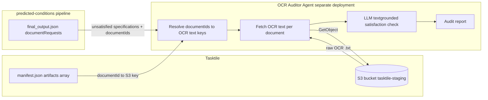

# OCR Auditor Agent — Design Spec

A proposed **separate system/deployment** that re-checks specifications this
pipeline (`predicted-conditions`) marked **unsatisfied** by reading the
**full raw OCR text** of the relevant document(s), instead of the sparse
structured fields this pipeline is limited to today. This document specifies
the problem, the data that is and isn't available, and the shape of the new
system — it does not change anything in that repo.

> This copy is vendored into `auditor-predicted-conditions` (this repo) as
> the design doc this repo implements. Source of truth / origin:
> `predicted-conditions/docs/ocr-auditor-agent-spec.md` in the sibling
> `predicted-conditions` repo.

---

## Table of Contents

- [Why this is needed](#why-this-is-needed)
- [Architecture](#architecture)
- [Input data contract](#input-data-contract)
- [OCR retrieval mechanism](#ocr-retrieval-mechanism)
- [Audit logic](#audit-logic)
- [Output data contract](#output-data-contract)
- [Deployment shape](#deployment-shape)
- [Open questions / risks](#open-questions--risks)

---

## Why this is needed

Investigation of the **Sahay Vibhor Binayprasad** case
(dev thread `86da8c54-fd65-4747-9997-000c9fde4461`) found that its Appraisal
Report document_request came back with **22 unsatisfied specifications** and
only 2 satisfied ones, even though the document's `vision_check` was
`"passed"` (full OCR succeeded) and every `exceptions` flag (`expired`,
`corrupted`, `truncated`, `blank_page`, `is_missing_pages`,
`copy_is_not_clear`, `insufficient_information`, `unsupported_language`) was
`false` — i.e. nothing was flagged as wrong with the document itself.

The root cause is not a bug in this pipeline's satisfaction logic. It's that
Tasktile's `manifest.json` `documents[].metadata` is a **sparse, fixed-size
extraction template per document category**, independent of how many pages
the document actually has:

| Category | Extracted fields | Typical page count |
|---|---|---|
| Appraisal Report | 4 | ~40 |
| Bank Statement | 5 | 4–10 |
| Purchase Contract | 5 | ~21 |
| Rental Agreement | 6 | ~2 |
| Credit Report | 16 | — |
| URLA 1003 | 25 | — |
| Form 1040 | 49 | — |

For the Sahay appraisal, the entire extracted `metadata` was just:

```json
{
  "value": 690000,
  "confidence": 0.9678754210472107,
  "total_pages": 40,
  "vision_check": "passed",
  "appraisalDate": "2026-09-08",
  "dateOfPriorSaleOrTransfer": "2025-11-10",
  "priceOfPriorSaleOrTransfer": null
}
```

This pipeline (see
[`tools/shared/manifest_parser.py`](../tools/shared/manifest_parser.py),
`NON_ENTITY_META_KEYS`) only ever consumes this `metadata` dict — it strips
`vision_check`, `exceptions`, `confidence`, and `total_pages` before anything
reaches the satisfaction-checking LLM, and it never sees the document's raw
page text. So a spec like *"Appraisal report must contain original color
photographs of the front, street, and rear views"* can never be verified from
this metadata, regardless of whether the appraisal PDF actually contains
those photos.

**New finding**: some manifests do carry a top-level `artifacts` array
alongside `documents`, with one entry per document pointing at a **full raw
OCR text file**:

```json
{
  "type": "ocr",
  "source": {
    "key": "clients/<client_id>/jobs/<job_id>/blobs/<blob_id>/ocr/<document_id>.txt",
    "bucket": "tasktile-staging"
  },
  "document_id": "53134a24-92f3-45b5-8468-58d593c99da3"
}
```

Confirmed via `compiled_inputs/montes_10x/manifest.json`: 32 documents, 32
`type: "ocr"` artifacts, a clean 1:1 mapping by `document_id`. This is a
**separate concern from `metadata`** — it's the full text Tasktile's OCR step
produced for that document, before/independent of the sparse structured
extraction. This repo has never fetched or used it (confirmed via repo-wide
grep — no `tasktile`/S3-client code exists outside this project's own
checkpoint-offload bucket in
[`infra/stacks/predicted_conditions_stack.py`](../infra/stacks/predicted_conditions_stack.py)).

The OCR Auditor Agent's purpose: for specs that come back unsatisfied because
the sparse `metadata` template simply didn't capture the relevant field, read
the full OCR text directly and make a real determination.

---

## Architecture



The auditor is intentionally **downstream and read-only** with respect to
this pipeline: it consumes this pipeline's output plus Tasktile's manifest,
and produces its own separate report. It does not write back into this
repo's DynamoDB checkpoint state or Lambda.

---

## Input data contract

Two inputs, both already produced by existing systems — nothing new needs to
be generated upstream for this half of the contract:

**1. Unsatisfied specifications**, sourced from this pipeline's
`final_output.document_requests[]` (see e.g.
`compiled_inputs/sahay/final_output.json`). Per document_request, the fields
the auditor needs:

```json
{
  "document_type": "Appraisal Report",
  "document_category": "Property",
  "document_ids": ["1893b393-b59b-4195-a181-05c01c4efac9"],
  "guideline_reference": "",
  "specifications": [
    "Appraisal report must contain original color photographs or digital color images of the front, street, and rear views of the subject property",
    "Appraisal report must contain a street map showing the location of the subject property and all comparable used",
    "... (22 total for this example)"
  ]
}
```

Note `document_ids` can be a **list** (multi-document requirements) or, per
the Sahay sample data, sometimes absent/empty on other request types — the
auditor needs a defined fallback for specs with no `document_ids` (see
[Open questions](#open-questions--risks)).

**2. The manifest slice needed to resolve OCR text locations** — from
`manifest.json`:
- `documents[]` — for `id` → `category.category_name` / `category_id`
  (cross-check that the audited document is really the category the spec
  expects).
- `artifacts[]` — for `document_id` → `source.bucket` / `source.key` of the
  OCR `.txt` file (`type == "ocr"`).

---

## OCR retrieval mechanism

For each `document_id` referenced by an unsatisfied spec:

1. Look up the matching entry in `manifest.artifacts` where
   `type == "ocr"` and `document_id` matches.
2. `GetObject(bucket=source.bucket, key=source.key)` — bucket observed as
   `tasktile-staging` in every sample checked.
3. The object body is the full raw OCR text for that document (all pages
   concatenated, based on the samples inspected).

This is a **new integration** — this repo has no existing AWS credentials,
IAM role, or client code scoped to the `tasktile-staging` bucket. It appears
to be Tasktile's own bucket (referenced the same way the original source PDF
blobs are, in `documents[].source` / `input[].source`), so access will
likely require either a cross-account IAM role/bucket policy grant from
Tasktile, presigned URLs issued at ingestion time, or a direct API call to
Tasktile rather than raw S3 access. **This is the single biggest open
dependency for this design** — see below.

---

## Audit logic

- **Batch by document, not by spec.** A single document's OCR text should be
  fetched once and reused for all of that document's unsatisfied specs in
  one LLM call, rather than re-fetching/re-sending the same (potentially
  large) text per spec. A 40-page appraisal's OCR text can be tens of
  thousands of tokens; batching bounds both cost and the number of round
  trips.
- **Prompt shape**: full OCR text + the list of that document's unsatisfied
  specification strings → ask the model to adjudicate each spec
  independently, grounded only in the provided text (no guessing beyond what
  the text supports).
- **Long-context handling**: choose a model/context window that can hold the
  largest expected OCR text in one call; if any document's OCR text exceeds
  that budget, a chunking/retrieval fallback (e.g. split by page markers if
  present in the `.txt`, or a first-pass keyword/semantic filter per spec)
  needs to be designed — not resolved by this spec, flagged as an open item.

---

## Output data contract

Per specification, per document:

```json
{
  "document_id": "1893b393-b59b-4195-a181-05c01c4efac9",
  "document_type": "Appraisal Report",
  "specification": "Appraisal report must contain a street map showing the location of the subject property and all comparable used",
  "verdict": "satisfied | still_unsatisfied | needs_human_review",
  "evidence_quote": "verbatim excerpt from the OCR text supporting the verdict, or null",
  "confidence": 0.0,
  "reasoning": "short explanation grounded in the quoted text"
}
```

An aggregate **audit report** rolls these up per document_request and is
meant to be diffed against the original `document_requests[].specifications`
/ `satisfied_specifications` split, so a reviewer can see exactly which
specs the full-text pass overturned versus confirmed.

---

## Deployment shape

- **Genuinely separate deployment** from `predicted-conditions-agent-{dev,prod}`
  — no shared Lambda, no shared runtime, no live code import from this repo.
- Own infra stack (own Lambda/service, own IAM role scoped to whatever OCR
  access mechanism is arranged) and its own entry point that accepts the two
  inputs above.
- It is reasonable for this new system to **vendor a copy of reference
  material** (e.g. the wording in
  [`data/canonical_doc_specs.json`](../data/canonical_doc_specs.json)) if
  useful for prompt construction, but it should not live-import this repo's
  code — the two systems are decoupled by the data contract above, not by
  shared libraries.

---

## Open questions / risks

1. **`tasktile-staging` bucket access is not guaranteed available.** This
   needs credentials/cross-account access arranged before this can be built
   at all — biggest blocker.
2. **The `artifacts` OCR references are not reliably present in the
   `manifest_json` this pipeline actually receives.** A fresh live re-fetch
   of the Sahay thread's state confirmed its `manifest_json` contains
   **only** a `documents` key — no `job`, `input`, `counts`, `artifacts`,
   `tenant`, or `version` at all (34 documents, 0 artifacts). Checking every
   locally cached sample (`compiled_inputs/*/manifest.json`) shows this is a
   real split, not a one-off:

   | Has `artifacts` | Missing `artifacts` (only `documents`) |
   |---|---|
   | alaska, bibby, bibby_10x, bransdorfer_repro, fields, manifest_92010155019–022, manifest_92010155038, montes, montes_10x, niccum, nyarko, nyarko_reeval, omalley_3_10x, weingarten (17) | aubrey, carlos, emmanuel, kelly_goldberg_10x, omalley_1_10x, omalley_2_10x, otodo_augustine_10x, pisa, pisa_10x, pullings_10x, **sahay**, segoviano_10x (12) |

   This split is not caused by anything in this repo (confirmed — no code
   here trims `manifest_json`; `tools/shared/manifest_parser.py` only reads
   `manifest.get("documents", [])` for its own parsing, it doesn't mutate
   the stored value). The difference exists in whatever payload the
   **upstream caller** submitted when starting each run — meaning roughly
   40% of real cases sampled, including the exact Sahay case that motivated
   this design, would have **no way to resolve OCR text today** even once
   bucket access is solved. This needs to be fixed at the run-submission
   layer (ensure the full raw Tasktile manifest, including `artifacts`, is
   always passed through) before the auditor agent can be relied on
   universally.
3. **Cost/latency** of long-context LLM calls per document, especially for
   loans with many large sparse-template documents (appraisals, multi-year
   bank statements, purchase contracts).
4. **Multi-document specs / missing `document_ids`**: some
   `document_requests` reference multiple `document_ids`; some (per the
   sampled schema) may have no `document_ids` at all. The auditor needs a
   defined behavior for both cases (e.g. audit against all referenced
   documents' OCR text; skip / flag `needs_human_review` when no
   `document_ids` are present).
5. **OCR text format assumptions** — page boundaries, ordering, and
   formatting within the `.txt` artifact haven't been inspected (only its
   existence/location was confirmed via the manifest's `artifacts[].source`
   reference); the actual file content should be pulled and examined before
   finalizing the audit prompt design.
